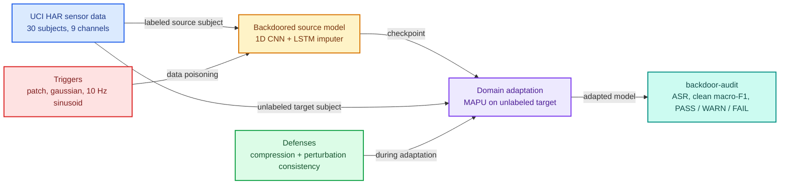
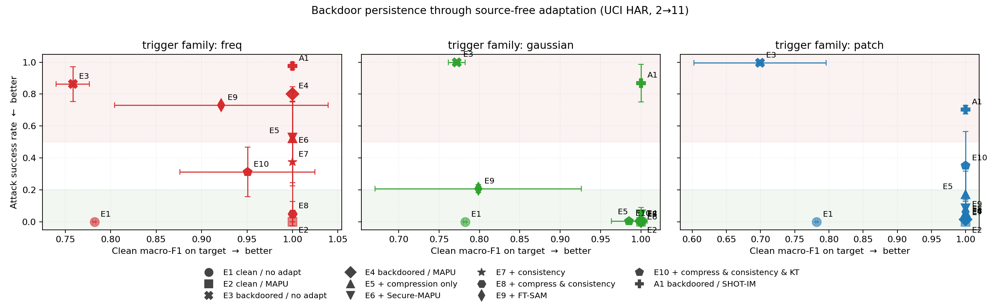

# Secure Time-Series Domain Adaptation

Machine learning security for time series: backdoor (data poisoning) attacks that survive
transfer learning and domain adaptation, and defenses that remove most of their effect.
PyTorch, UCI HAR.

A model trained on one domain (the source) is often adapted to a new domain (the target)
using only unlabeled target data. If the source model was trained by someone else, it may
contain a backdoor: a hidden rule that makes it output an attacker-chosen class whenever a
trigger pattern appears in the input. This project measures whether such backdoors survive
domain adaptation on sensor time series, and evaluates defenses that try to remove them
without hurting accuracy.

It includes the full pipeline (data preparation, poisoned source training, adaptation,
defenses and evaluation), a command-line tool that audits a checkpoint and writes a report,
and scripts that reproduce every table and figure below.



## Setup at a glance

| | |
|---|---|
| Task | Human activity recognition (classification), 6 classes |
| Data | [UCI HAR](https://archive.ics.uci.edu/dataset/240): 10,299 windows, 9 inertial channels, 128 samples at 50 Hz, 30 subjects |
| Domain shift | Cross-person. Tuned on subject 2 → 11, then run on 9 more subject pairs: 4 for development and 5 held out as a test set |
| Model | AdaTime 1D CNN encoder (201k parameters) with a linear classifier |
| Adaptation | [MAPU](https://arxiv.org/abs/2307.07542) (KDD 2023), source-free; SHOT-IM (SHOT without pseudo-labels) as an ablation |
| Attacks | Three triggers poisoning 10-15% of the non-WALKING source training windows (8-12% of all), target class WALKING |
| Defenses | Channel compression, SSDA, FT-SAM, perturbation consistency, compression + consistency (E8), and E8 + knowledge transfer (E10) |

The three triggers are a square **patch** on three channels over 10 samples, a **gaussian**
noise segment replacing 16 samples on every channel, and a 10 Hz **freq** sinusoid added to
the whole window. Each is applied to the raw signal before normalization.

## Results

### Held-out subject pairs

Defense settings were first tuned on one pair, subject 2 → 11. To check that they carry over,
the experiment matrix was run on more pairs in two stages, with no config changes in between:

1. **Development.** MAPU's other four UCI HAR pairs, with E8 unchanged. Five label-free variants
   of E8 were then compared on all five MAPU pairs, and `scripts/select_defense.py` chose one by
   a rule fixed in advance: the lowest worst-trigger ASR among variants whose clean macro-F1 is
   within 2 points of MAPU without a defense. The chosen variant adds knowledge transfer and is
   called E10.
2. **Test.** AdaTime's five other HAR pairs, run once after E10 was fixed.

Results on the five test pairs:

<!-- test-summary -->
Summary over 5 subject pairs (18->27, 20->5, 24->8, 28->27, 30->20). Worst-trigger ASR is the
highest seed-mean ASR of the three triggers on a pair; clean MF1 is pooled over all runs.

| Defense | Mean worst-trigger ASR (%) | Pairs with worst-trigger ASR ≤ 20% | Clean MF1 |
|---|---|---|---|
| **E3** no adaptation | 96.9 | 0 of 5 | 86.8 |
| **E4** MAPU (no defense) | 53.1 | 0 of 5 | 91.5 |
| **A1** SHOT-IM (ablation) | 84.5 | 0 of 5 | 87.5 |
| **E5** + spectral-norm compression | 25.1 | 2 of 5 | 89.9 |
| **E6** + Secure-MAPU (SSDA, ICCV'23) | 31.5 | 1 of 5 | 89.1 |
| **E9** + FT-SAM (ICCV'23) | 44.1 | 0 of 5 | 78.7 |
| **E7** + perturbation consistency | 20.0 | 3 of 5 | 91.8 |
| **E8** + compression & consistency | 13.2 | 4 of 5 | 86.3 |
| **E10** + compression & consistency & KT | 17.7 | 3 of 5 | 89.9 |
<!-- test-summary -->

Per-trigger results are in [results/test_table.md](results/test_table.md), and the development
pairs and the selection are in [results/dev_table.md](results/dev_table.md) and
[results/selection.md](results/selection.md).

### Tuning pair (2 → 11)

<!-- headline-table -->
Attack success rate (%) on the target domain, lower is better.
3 seeds, mean ± std; clean MF1 is pooled over the three triggers. Scenario 2->11.

| Defense | patch | gaussian | freq | Clean MF1 |
|---|---|---|---|---|
| **E3** no adaptation | 99.5 ± 0.8 | 100.0 ± 0.0 | 86.3 ± 11.9 | 74.3 ± 6.3 |
| **E4** MAPU (no defense) | 1.4 ± 0.0 | 0.5 ± 0.8 | 80.2 ± 5.0 | 100.0 ± 0.0 |
| **A1** SHOT-IM (ablation) | 70.3 ± 2.7 | 87.0 ± 11.8 | 97.6 ± 2.1 | 100.0 ± 0.0 |
| **E5** + spectral-norm compression | 17.1 ± 14.8 | 1.4 ± 1.4 | 52.3 ± 30.6 | 100.0 ± 0.0 |
| **E6** + Secure-MAPU (SSDA, ICCV'23) | 8.4 ± 8.6 | 4.8 ± 4.4 | 52.8 ± 29.5 | 100.0 ± 0.0 |
| **E9** + FT-SAM (ICCV'23) | 6.2 ± 7.2 | 20.7 ± 2.9 | 73.1 ± 1.7 | 90.7 ± 12.9 |
| **E7** + perturbation consistency | 0.9 ± 0.8 | 0.0 ± 0.0 | 37.5 ± 37.6 | 100.0 ± 0.0 |
| **E8** + compression & consistency | **3.3 ± 1.7** | **0.0 ± 0.0** | **5.1 ± 8.8** | **100.0 ± 0.0** |
| **E10** + compression & consistency & KT | 35.2 ± 22.6 | 0.5 ± 0.8 | 31.3 ± 15.5 | 97.9 ± 5.0 |
<!-- headline-table -->



Main findings:

- **Backdoors survive the domain shift.** Before adaptation the triggers reach 86-100% attack
  success rate (ASR) on subject 11, while the poisoned source models keep 99.6-100% accuracy on
  clean source data. On the test pairs the mean worst-trigger ASR before adaptation is 96.9%.
- **MAPU removes time-localized triggers but not the spectral one.** On 2 → 11 the patch and
  gaussian triggers drop to 1.4% and 0.5% after adaptation, but the 10 Hz sinusoid stays at
  80.2%, and at 53.1% on average over the test pairs. MAPU masks blocks of time and trains the
  encoder to reconstruct them, which likely disrupts a short trigger but not one spread over
  the whole window.
- **The imputation loss is what removes them.** Adapting with SHOT-IM (MAPU's loss without the
  imputation term) leaves the patch and gaussian triggers at 70.3% and 87.0% on 2 → 11, and at
  64.3% and 75.2% on the test pairs.
- **Published defenses do not fix the spectral trigger.** On 2 → 11 channel compression leaves
  it at 52.3%, SSDA at 52.8% and FT-SAM at 73.1%. On the test pairs SSDA and FT-SAM leave a mean
  worst-trigger ASR of 31.5% and 44.1%. FT-SAM's rho was picked on an earlier, leaky split and
  not re-tuned, so it may be under-tuned here.
- **Compression plus perturbation consistency removes the most, at some accuracy cost.** E8
  brings every trigger to 5.1% or below on 2 → 11 without losing accuracy. On the test pairs it
  lowers the mean worst-trigger ASR from 53.1% (MAPU alone) to 13.2%, below 20% on four of five
  pairs, while clean macro-F1 drops from 91.5 to 86.3. E10 reaches 17.7% at 89.9, and
  consistency alone (E7) 20.0% at 91.8. The random perturbations are wide enough to include the
  10 Hz trigger; with 5-15 Hz removed from them, E8's freq ASR on the test pairs goes from 6.5%
  to 8.6%, so most of the effect does not rely on seeing that frequency.
- **Results vary between subject pairs.** On development pair 9 → 18, E8 leaves a worst-trigger
  ASR of 36.5% and lowers macro-F1 to 52.0.

More detail, including the ablations, the compression sweep and the per-pair results, is in
[docs/report.md](docs/report.md).

## Installation

Requires Python 3.11 or 3.12 (the pinned NumPy has no wheels for 3.13). A CUDA GPU is
recommended for the full experiments; the tests and the smoke run work on CPU.

```bash
git clone https://github.com/abidhasanzim/STDA.git
cd STDA

python -m venv .venv
source .venv/bin/activate

pip install -r requirements.txt        # CUDA 12.4 build of PyTorch
# pip install -r requirements-cpu.txt  # CPU-only alternative
pip install -e . --no-deps
```

## Quick start

Run all commands from the repository root.

```bash
make data     # download and preprocess UCI HAR into data/processed/har.npz
make test     # fast test suite
make smoke    # train, adapt and audit a small model on the bundled test fixture
```

Train a backdoored source model and audit it:

```bash
python -m src.mapu.train_source --attack configs/attack/patch.yaml --tag bd-patch
backdoor-audit run --checkpoint checkpoints/source_bd-patch_har_s2_seed42.pt --out results/demo/
```

```
  🔴 VERDICT: FAIL
  worst-family ASR 100.0% exceeds the fail threshold of 50%
  clean acc 82.6%  macro-F1 74.0%  (n=86)
  ASR[patch    ] 100.0%  95% CI [100.0%, 100.0%]   untriggered target rate 4.2%
  ASR[gaussian ]   7.0%  95% CI [1.4%, 12.7%]   untriggered target rate 4.2%
  ASR[freq     ]   4.2%  95% CI [0.0%, 8.5%]   untriggered target rate 4.2%
```

Adapt a model to the target subject with a defense, then audit the result:

```bash
python -m src.mapu.train_source --attack configs/attack/freq.yaml --tag bd-freq
backdoor-audit run --checkpoint checkpoints/source_bd-freq_har_s2_seed42.pt \
                   --adapt mapu --defense combined --out results/demo_defended/
```

```
  🟢 VERDICT: PASS
  worst-family ASR 0.0% is at or below the warn threshold of 20% and does not exceed the untriggered target rate of 0.0%
  clean acc 100.0%  macro-F1 100.0%  (n=86)
  ASR[patch    ]   0.0%  95% CI [0.0%, 0.0%]   untriggered target rate 0.0%
  ASR[freq     ]   0.0%  95% CI [0.0%, 0.0%]   untriggered target rate 0.0%
  ASR[gaussian ]   0.0%  95% CI [0.0%, 0.0%]   untriggered target rate 0.0%

  before adaptation:
  ASR[freq     ] 100.0%  ->    0.0%  (-100.0%)
  ASR[gaussian ]  32.4%  ->    0.0%  (-32.4%)
  ASR[patch    ]  23.9%  ->    0.0%  (-23.9%)
```

Both outputs come from runs on a GPU. Training and adapting on CPU give different models, so
the numbers there will differ.

Each run writes `report.md` and `result.json` to the output directory. Available defenses
are `none`, `compress`, `consistency`, `combined`, `combined-kt`, `sam` and `secure-mapu`, or
a path to a defense YAML file; `--defense` requires `--adapt`. The CLI exits with code 2 when
the verdict is FAIL.

A Streamlit dashboard is also included: `make demo`.

## Reproducing the results

```bash
make reproduce        # everything; several hours on one RTX 3090
make reproduce-fast   # subject 2 -> 11 only, without the sweeps
```

This downloads the data, runs lint and tests, trains 12 source models per subject pair (clean
and three backdoored, three seeds each), runs all experiments and writes:

| File | Contents |
|---|---|
| `results/runs.jsonl` | Subject 2 → 11, one record per run (87 runs) |
| `results/table.md` | Full results table for 2 → 11, including control columns |
| `results/dev_runs.jsonl`, `results/dev_table.md` | MAPU's other four pairs (348 runs) |
| `results/selection_runs.jsonl`, `results/selection.md` | E8 variants on the five MAPU pairs and the chosen one |
| `results/test_runs.jsonl`, `results/test_table.md` | AdaTime's five other pairs, the test set (435 runs) |
| `results/band_ablation_runs.jsonl`, `results/band_ablation.md` | E8 with 5-15 Hz removed from the perturbations, all ten pairs (90 runs) |
| `results/tradeoff.png` | ASR vs clean macro-F1 for every experiment |
| `results/ablation.jsonl`, `results/ablation.md` | SSDA component and lambda ablation |
| `results/tradeoff_curve.jsonl`, `results/compression_curve.png` | Compression-strength sweep |
| `results/demo/`, `results/demo_defended/` | Example audit reports |

Use `PY=/path/to/python make reproduce` to pick an interpreter. Some CUDA kernels are not
deterministic, so GPU runs can differ slightly from the committed numbers.

To print the headline table from new results, run `python scripts/write_headline_table.py`
(add `--runs results/test_runs.jsonl --summary` for the test-pair summary).

### Experiments

| ID | Source model | Adaptation | Defense |
|---|---|---|---|
| E1 | clean | none | - |
| E2 | clean | MAPU | - |
| E3 | backdoored | none | - |
| E4 | backdoored | MAPU | - |
| E5 | backdoored | MAPU | spectral-norm channel compression |
| E6 | backdoored | MAPU | SSDA: compression + knowledge transfer + spectral penalty |
| E7 | backdoored | MAPU | perturbation consistency |
| E8 | backdoored | MAPU | compression + perturbation consistency |
| E9 | backdoored | MAPU | FT-SAM (sharpness-aware minimization) |
| E10 | backdoored | MAPU | compression + perturbation consistency + knowledge transfer |
| A1 | backdoored | SHOT-IM | - |

The backdoored experiments (E3-E10, A1) run for every trigger and for seeds 42, 43 and 44, and
the clean-model experiments E1 and E2 once per seed, 87 runs per subject pair. On subject 11,
clean models reach 78.2 (E1) and 100.0 (E2) macro-F1.

## Project structure

```
configs/      YAML configs for data, model, training, attacks, defenses and evaluation
src/
  data/       UCI HAR parsing, subject domains, leakage-free splits, loaders
  models/     1D CNN encoder, classifier, LSTM temporal imputer
  attack/     trigger implementations and dataset poisoning
  mapu/       source training, MAPU and SHOT-IM adaptation, masking, losses
  defense/    compression, spectral penalty, SSDA pipeline, SAM, perturbation consistency
  eval/       ASR, clean accuracy, bootstrap CIs, verdicts, reports
  cli.py      backdoor-audit command
scripts/      experiment runners, sweeps, plotting and reproduction scripts
dashboard/    Streamlit app
tests/        unit and end-to-end tests (CPU)
docs/         report, limitations, threat model, implementation notes
results/      committed results, tables and figures
```

## Notes on evaluation

- **ASR** is computed only over test windows whose true label is not already the target class,
  so a model that always predicts the target class does not look like a successful attack.
  The report also shows the rate without the trigger for comparison.
- **Splits.** UCI HAR windows overlap by 50%. Splitting on shuffled window indices would put
  93-95% of test windows next to an overlapping training window. Splits are therefore made
  by contiguous recording segment; `python scripts/check_split_leakage.py` shows the difference.
- **Sanity check.** On the bundled test fixture, randomly initialized models score 0.194 clean
  accuracy and 0.160 ASR on average, close to the 1/6 chance rate (`tests/test_harness_e2e.py`).
- **Tuning.** The settings of E6-E9 were chosen using labeled test data from subject 11, and E10
  was chosen on the development pairs. The test pairs were not used for any choice. The
  evaluation still covers one dataset and three fixed triggers.
  See [docs/limitations.md](docs/limitations.md).

## Documentation

- [docs/report.md](docs/report.md): method details and full results
- [docs/limitations.md](docs/limitations.md): what the evaluation does not cover
- [docs/threat_model.md](docs/threat_model.md): attacker and defender assumptions
- [docs/reproduction_notes.md](docs/reproduction_notes.md): how this implementation relates to the MAPU and SSDA code

## References

1. Ragab et al. *Source-Free Domain Adaptation with Temporal Imputation for Time Series Data* (MAPU). KDD 2023.
2. Ragab et al. *AdaTime: A Benchmarking Suite for Domain Adaptation on Time Series Data*. ACM TKDD 2023.
3. Liang et al. *Do We Really Need to Access the Source Data?* (SHOT). ICML 2020.
4. Ahmed et al. *SSDA: Secure Source-Free Domain Adaptation*. ICCV 2023.
5. Zhu et al. *Enhancing Fine-Tuning Based Backdoor Defense with Sharpness-Aware Minimization* (FT-SAM). ICCV 2023.
6. Zheng et al. *Data-Free Backdoor Removal Based on Channel Lipschitzness* (CLP). ECCV 2022.
7. Jiang et al. *Active Poisoning: Efficient Backdoor Attacks on Transfer Learning-Based Brain-Computer Interfaces*. Science China Information Sciences 2023.
8. Ding et al. *Towards Backdoor Attack on Deep Learning Based Time Series Classification* (TimeTrojan). ICDE 2022.
9. Jiang et al. *Backdoor Attacks on Time Series: A Generative Approach* (TSBA). IEEE SaTML 2023.
10. Dong et al. *TrojanTime: Backdoor Attacks on Time Series Classification*. arXiv 2502.00646.
11. Huang et al. *Revisiting Backdoor Attacks on Time Series Classification in the Frequency Domain* (FreqBack). WWW 2025.
12. Anguita et al. *A Public Domain Dataset for Human Activity Recognition Using Smartphones*. ESANN 2013.

## License

MIT. See [LICENSE](LICENSE). This code is intended for research on defending models; all
experiments use a public dataset and locally trained models.
